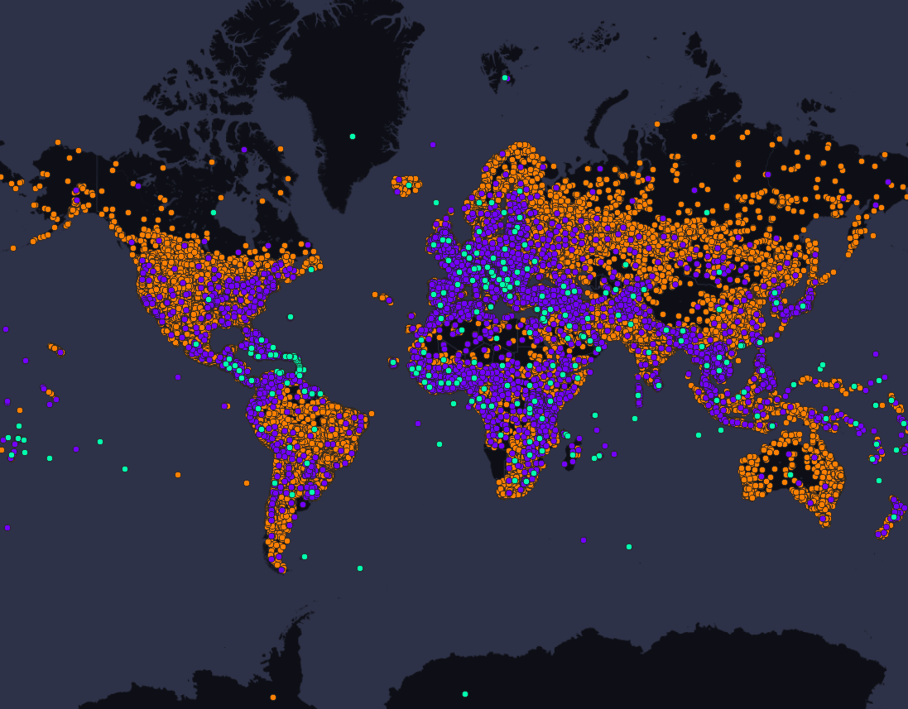

## Objetive
- The client requires a script capable of:
    1. **Download and update** information about **countries**, **states** and **cities** with automatic updating.
    2. Store the collections within a **MongoDB**.
    3. In case of errors, report unstored information.


## Solution
- A script is designed that collects information from:
    1. [Countries States Cities (CSC)](https://github.com/dr5hn/countries-states-cities-database/tree/master)
    2. [WikiData](https://www.wikidata.org/wiki/Wikidata:Main_Page)
- For each collected field, it checks whether it should be **inserted or updated** within the **MongoDB**.


## Quick Start
- Virtual environment and installation of dependencies.
```bash
cd /path/to/project/geodata
python3 -m venv env
source env/bin/activate
pip install -r requirements.txt
```

## Make .env
```bash
# Inside `.env`.
DB_NAME=world_data
HOST=localhost
PORT=27017
USERNAME=my_username
PASSWORD=my_password
```

## How to use.
- The following scripts can be run in any order or skipping some.
- It is suggested to do it in the marked order for an optimized download.
- There are 3 scripts for downloading and updating the DB:
0. `config_indexes.py:` For the first and only time, run to set the unique indexes on the collections.
1. `download_csc.py:` Download data from the **Countries-States-Cities Github repository**. Creates and updates collections within the DB.
2. `download_id_wikidata.py:` Given the **country_code** and the **place name**. Search WikiData with those clauses and extract their associated **wikidata_id**.
3. `download_websites_postals.py:` Given the **id_wikidata**, it searches WikiData for postal codes and websites, only adding non-repeated ones other than empty. And accumulates them in a **list**.

#### Execution
- You can run them from bash with **VERBOSE=True** and redirecting the output to a **.log**.
```bash
python3 download_csc.py >> _download_csc.log
python3 download_id_wikidata.py >> _download_id_wikidata.log
python3 download_websites_postals.py >> _download_websites_postals.log
```

#### Subdivision of States
- The **CSC API** considers **city** as the smallest subdivision, and **States** as a set of **Cities**.
- You can see all States categories inside **geodata/db/models/state.py**.


#### Config
- It contains the name of the DB, it can be changed in case you want to perform tests, without having to make backups or migrate.
- You can change the name and a new DB will be generated from scratch.
- You can change and add config fields and script behavior in **geodata/db/config**.
- **Cfg** object is saved inside **WorldDataDB** object.


## Environment Variables (Not Used, can ignore).
- **Disclaimer:** The CSC API_KEY was not used, instead a request is made to bring the data. Although it can be added.
- We create the .env for the environment variables.
- Requests [API_KEY_CSC](https://countrystatecity.in/) in the "Requests API Key" section
```bash
# Inside `.env`.
API_KEY_CSC="..."
```
